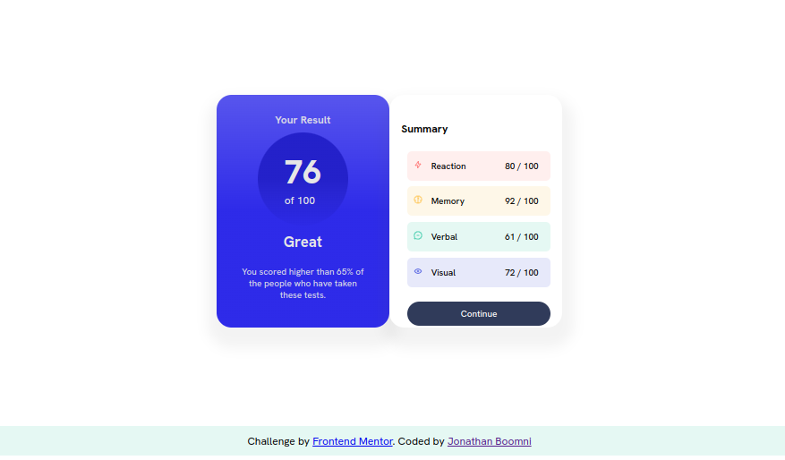

# Frontend Mentor - Results summary component solution

This is my solution to the [Results summary component challenge on Frontend Mentor](https://www.frontendmentor.io/challenges/results-summary-component-CE_K6s0maV). Frontend Mentor challenges help developers improve their coding skills by building realistic projects.

## Table of Contents

- [Overview](#overview)
  - [The Challenge](#the-challenge)
  - [Screenshot](#screenshot)
  - [Links](#links)
- [My Process](#my-process)
  - [Built With](#built-with)
  - [What I Learned](#what-i-learned)
  - [Continued Development](#continued-development)
  - [Useful Resources](#useful-resources)
- [Author](#author)
- [Acknowledgments](#acknowledgments)

## Overview

### The Challenge

The challenge was to build a responsive results summary component that displays the results of a search query.

Users should be able to:

- View the optimal layout for the interface depending on their device's screen size
- See hover and focus states for all interactive elements on the page

### Screenshot

### Links

- [Live Site](https://lively-cocada-1ee5e0.netlify.app/)

## My Process

### Built With

- HTML5
- CSS3

### What I Learned

Through this project, I gained experience with:

- Building a responsive layout using flexbox

### Continued Development

In future projects, I want to continue focusing on accessibility, css grid, responsiveness and improving my CSS skills.

### Useful Resources

- [MDN Web Docs](https://developer.mozilla.org/en-US/) - A great resource for web development
- [W3Schools](https://www.w3schools.com/) - Another useful resource for learning web development
- [CSS Tricks](https://css-tricks.com/) - A blog with helpful tips and tricks for CSS

## Author

- Twitter: [Jonathan Boomni](https://twitter.com/rejoiceoye1)
